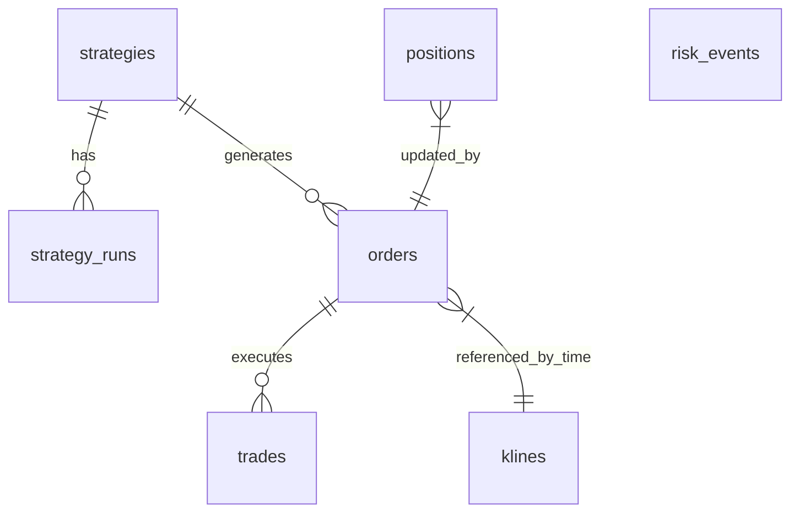

# 数据库设计

本设计文档描述 Kurisu 在基础阶段的数据库 Schema 设计，目标是同时支撑行情时序数据、交易执行数据与策略配置数据的统一存储，并为后续 TimescaleDB 分区、持续聚合与历史归档提供演进空间。

## 1. 设计目标

- **统一存储**：市场数据、交易数据与策略配置共用 PostgreSQL + TimescaleDB。
- **高性能写入**：K 线和成交数据支持高吞吐追加写入。
- **查询可维护**：使用清晰的命名与约束，便于分析与回放。
- **可扩展**：为后续 Agent 记忆与更多交易所接入预留字段与索引。
- **风控与审计**：完整的订单生命周期追踪与风险事件记录。

## 2. 命名与类型约定

- 表名使用复数小写：`klines`, `orders`, `trades`, `positions`, `strategies`, `strategy_runs`, `risk_events`
- 时间字段使用 `timestamptz`
- 数值字段使用 `numeric(18, 8)`
- 外部 ID 使用字符串（`exchange_order_id`, `exchange_trade_id`）
- 主键采用 UUID 或自增 ID，按访问模式决定。UUID 由应用层默认生成，必要时也可在数据库侧补充默认值。
- 状态与方向字段建议使用枚举或字符串约束

## 3. 核心表设计

### 3.1 行情表：klines

用于存储 K 线数据，按交易所、交易对、周期与开盘时间唯一定位。

**字段：**
- `exchange`: Varchar(50) 交易所标识 (PK)
- `symbol`: Varchar(50) 交易对 (PK)
- `interval`: Varchar(10) 周期（1m/5m/1h/1d 等） (PK)
- `open_time`: Timestamptz 开盘时间 (PK, 分区键)
- `close_time`: Timestamptz 收盘时间
- `open`: Numeric(18, 8) 开盘价
- `high`: Numeric(18, 8) 最高价
- `low`: Numeric(18, 8) 最低价
- `close`: Numeric(18, 8) 收盘价
- `volume`: Numeric(18, 8) 成交量
- `quote_volume`: Numeric(18, 8) 计价成交量
- `trade_count`: Integer 成交笔数
- `taker_buy_base_volume`: Numeric(18, 8) 主动买入基础资产量
- `taker_buy_quote_volume`: Numeric(18, 8) 主动买入计价资产量
- `updated_at`: Timestamptz 记录更新时间

**约束与索引：**
- 主键：`(exchange, symbol, interval, open_time)`
- 索引：`(exchange, symbol, interval, open_time DESC)` - 优化最新 K 线查询

**TimescaleDB 规划：**
- `klines` 转换为 hypertable
- **分区键**：`open_time`
- **分区区间**：建议 1 天或 7 天一个 chunk（根据数据量调整）
- **压缩策略**：超过 30 天的数据启用列式压缩 (segment by `exchange`, `symbol`, `interval`)，压缩比可达 90%+
- **保留策略**：原始数据保留 1 年，超过后可降采样或归档
- **持续聚合**：自动生成 1h/4h/1d 聚合表，减少查询计算量

### 3.2 策略表：strategies

存储策略定义与参数配置，支持 AI 自动生成与人工维护。

**字段：**
- `id`: UUID 主键
- `name`: Varchar(100) 策略名称（唯一）
- `description`: Text 描述
- `code`: Text 策略代码
- `parameters`: JSONB 参数
- `version`: Integer 版本号
- `status`: Varchar(20) 状态 (draft/active/archived)
- `risk_level`: Varchar(20) 风险等级 (low/medium/high)
- `max_position_size`: Numeric(18, 8) 最大仓位限制
- `allowed_symbols`: JSONB 允许交易的标的列表
- `created_by`: Varchar(100) 创建者（human/agent）
- `created_at`: Timestamptz
- `updated_at`: Timestamptz

**索引：**
- `name` (Unique)
- `status`

### 3.3 策略运行记录表：strategy_runs

记录每次策略执行的上下文与结果。

**字段：**
- `id`: UUID 主键
- `strategy_id`: UUID 外键关联 `strategies.id`
- `started_at`: Timestamptz 开始时间
- `ended_at`: Timestamptz 结束时间
- `status`: Varchar(20) (running/completed/failed)
- `total_pnl`: Numeric(18, 8) 总盈亏
- `trade_count`: Integer 交易次数
- `error_message`: Text 错误信息
- `context`: JSONB 运行时的市场环境、参数快照

**索引：**
- `(strategy_id, started_at DESC)`

### 3.4 订单表：orders

用于存储下单请求与交易所返回状态，支持回测与实盘统一查询。

**字段：**
- `id`: UUID 主键
- `strategy_id`: UUID 外键关联 `strategies.id` (可为空)
- `user_id`: UUID (多用户场景预留)
- `exchange`: Varchar(50) 交易所标识
- `symbol`: Varchar(50) 交易对
- `side`: Varchar(10) (buy/sell)
- `order_type`: Varchar(20) (market/limit/stop_loss/take_profit)
- `status`: Varchar(20) (open/closed/canceled/failed)
- `time_in_force`: Varchar(10) (GTC/IOC/FOK)
- `price`: Numeric(18, 8) 委托价格
- `amount`: Numeric(18, 8) 委托数量
- `filled`: Numeric(18, 8) 已成交数量
- `average_price`: Numeric(18, 8) 成交均价
- `client_order_id`: Varchar(100) 客户端订单号
- `exchange_order_id`: Varchar(100) 交易所订单号
- `error_message`: Text 失败原因记录
- `raw`: JSONB 原始回包
- `submitted_at`: Timestamptz 提交时间
- `executed_at`: Timestamptz 最后成交/结束时间
- `created_at`: Timestamptz
- `updated_at`: Timestamptz

**索引：**
- `(exchange, symbol)`
- `exchange_order_id`
- `(strategy_id, created_at)` -- 按策略查询订单历史
- `(status, created_at)` -- 查询未完成订单
- `client_order_id` (Unique)

### 3.5 成交表：trades

记录实际成交或回测撮合结果。

**字段：**
- `id`: UUID 主键
- `order_id`: UUID 外键关联 `orders.id` (可为空)
- `exchange`: Varchar(50) 交易所标识
- `symbol`: Varchar(50) 交易对
- `side`: Varchar(10) (buy/sell)
- `price`: Numeric(18, 8) 成交价格
- `amount`: Numeric(18, 8) 成交数量
- `fee_amount`: Numeric(18, 8) 手续费数量
- `fee_currency`: Varchar(20) 手续费币种
- `is_maker`: Boolean 是否为挂单方
- `realized_pnl`: Numeric(18, 8) 该笔成交实现的盈亏 (可选)
- `exchange_trade_id`: Varchar(100) 交易所成交号
- `executed_at`: Timestamptz 成交时间
- `raw`: JSONB 原始回包
- `created_at`: Timestamptz

**索引：**
- `(exchange, symbol, executed_at DESC)`
- `order_id`
- `exchange_trade_id`

### 3.6 持仓表：positions

聚合持仓快照，用于风险控制与账户展示。

**字段：**
- `id`: UUID 主键
- `exchange`: Varchar(50) 交易所标识
- `symbol`: Varchar(50) 交易对
- `side`: Varchar(10) (long/short)
- `size`: Numeric(18, 8) 持仓数量
- `entry_price`: Numeric(18, 8) 开仓均价
- `mark_price`: Numeric(18, 8) 标记价格
- `liquidation_price`: Numeric(18, 8) 强平价格
- `margin`: Numeric(18, 8) 保证金
- `margin_mode`: Varchar(20) (isolated/cross)
- `leverage`: Numeric(18, 8) 杠杆倍数
- `unrealized_pnl`: Numeric(18, 8) 未实现盈亏
- `realized_pnl`: Numeric(18, 8) 已实现盈亏
- `stop_loss`: Numeric(18, 8) 止损价
- `take_profit`: Numeric(18, 8) 止盈价
- `last_synced_at`: Timestamptz 最后同步时间
- `created_at`: Timestamptz
- `updated_at`: Timestamptz

**约束与索引：**
- 唯一约束：`(exchange, symbol, side)`
- 索引：`(exchange, updated_at)`

### 3.7 风控事件表：risk_events

记录风控触发事件。

**字段：**
- `id`: UUID 主键
- `event_type`: Varchar(50) (margin_call/liquidation_warning/drawdown_limit/api_error)
- `severity`: Varchar(20) (info/warning/critical)
- `exchange`: Varchar(50)
- `symbol`: Varchar(50)
- `details`: JSONB 事件详情
- `created_at`: Timestamptz 触发时间
- `resolved_at`: Timestamptz 解决时间 (可选)

**索引：**
- `(created_at, severity)`

## 4. 数据库定义 (DDL)

以下是当前数据库的初始化 SQL (适用于 PostgreSQL 13+):

```sql
BEGIN;

-- 1. 基础表定义

CREATE TABLE klines (
    exchange VARCHAR(50) NOT NULL, 
    symbol VARCHAR(50) NOT NULL, 
    interval VARCHAR(10) NOT NULL, 
    open_time TIMESTAMP WITH TIME ZONE NOT NULL, 
    close_time TIMESTAMP WITH TIME ZONE NOT NULL, 
    open NUMERIC(18, 8) NOT NULL, 
    high NUMERIC(18, 8) NOT NULL, 
    low NUMERIC(18, 8) NOT NULL, 
    close NUMERIC(18, 8) NOT NULL, 
    volume NUMERIC(18, 8) NOT NULL, 
    quote_volume NUMERIC(18, 8) NOT NULL, 
    trade_count INTEGER NOT NULL, 
    taker_buy_base_volume NUMERIC(18, 8) NOT NULL, 
    taker_buy_quote_volume NUMERIC(18, 8) NOT NULL, 
    updated_at TIMESTAMP WITH TIME ZONE DEFAULT now() NOT NULL, 
    PRIMARY KEY (exchange, symbol, interval, open_time)
);

CREATE INDEX idx_klines_latest ON klines (exchange, symbol, interval, open_time DESC);

-- 可选：TimescaleDB Hypertable
-- CREATE EXTENSION IF NOT EXISTS timescaledb CASCADE;
-- SELECT create_hypertable('klines', 'open_time', chunk_time_interval => INTERVAL '1 day', if_not_exists => TRUE);

CREATE TABLE positions (
    id UUID NOT NULL, 
    exchange VARCHAR(50) NOT NULL, 
    symbol VARCHAR(50) NOT NULL, 
    side VARCHAR(10) NOT NULL, 
    size NUMERIC(18, 8) NOT NULL, 
    entry_price NUMERIC(18, 8) NOT NULL, 
    mark_price NUMERIC(18, 8), 
    liquidation_price NUMERIC(18, 8), 
    margin NUMERIC(18, 8), 
    margin_mode VARCHAR(20) DEFAULT 'isolated', 
    leverage NUMERIC(18, 8) DEFAULT 1, 
    unrealized_pnl NUMERIC(18, 8), 
    realized_pnl NUMERIC(18, 8), 
    stop_loss NUMERIC(18, 8), 
    take_profit NUMERIC(18, 8), 
    last_synced_at TIMESTAMP WITH TIME ZONE DEFAULT now(), 
    created_at TIMESTAMP WITH TIME ZONE DEFAULT now(), 
    updated_at TIMESTAMP WITH TIME ZONE DEFAULT now(), 
    PRIMARY KEY (id), 
    CONSTRAINT uq_positions_exchange_symbol_side UNIQUE (exchange, symbol, side)
);

CREATE INDEX idx_positions_exchange_updated ON positions (exchange, updated_at);

CREATE TABLE risk_events (
    id UUID NOT NULL, 
    event_type VARCHAR(50) NOT NULL, 
    severity VARCHAR(20) NOT NULL, 
    exchange VARCHAR(50) NOT NULL, 
    symbol VARCHAR(50) NOT NULL, 
    details JSONB, 
    created_at TIMESTAMP WITH TIME ZONE DEFAULT now(), 
    resolved_at TIMESTAMP WITH TIME ZONE, 
    PRIMARY KEY (id)
);

CREATE INDEX idx_risk_events_created_severity ON risk_events (created_at, severity);

CREATE TABLE strategies (
    id UUID NOT NULL, 
    name VARCHAR(100) NOT NULL, 
    description TEXT, 
    code TEXT, 
    parameters JSONB, 
    version INTEGER DEFAULT 1, 
    status VARCHAR(20) DEFAULT 'draft', 
    risk_level VARCHAR(20) DEFAULT 'medium', 
    max_position_size NUMERIC(18, 8), 
    allowed_symbols JSONB, 
    created_by VARCHAR(100), 
    created_at TIMESTAMP WITH TIME ZONE DEFAULT now(), 
    updated_at TIMESTAMP WITH TIME ZONE DEFAULT now(), 
    PRIMARY KEY (id), 
    UNIQUE (name)
);

CREATE TABLE orders (
    id UUID NOT NULL, 
    strategy_id UUID, 
    user_id UUID, 
    exchange VARCHAR(50) NOT NULL, 
    symbol VARCHAR(50) NOT NULL, 
    side VARCHAR(10) NOT NULL, 
    order_type VARCHAR(20) NOT NULL, 
    status VARCHAR(20) NOT NULL DEFAULT 'open', 
    time_in_force VARCHAR(10) DEFAULT 'GTC', 
    price NUMERIC(18, 8), 
    amount NUMERIC(18, 8) NOT NULL, 
    filled NUMERIC(18, 8) DEFAULT 0, 
    average_price NUMERIC(18, 8), 
    client_order_id VARCHAR(100), 
    exchange_order_id VARCHAR(100), 
    error_message TEXT, 
    raw JSONB, 
    submitted_at TIMESTAMP WITH TIME ZONE DEFAULT now(), 
    executed_at TIMESTAMP WITH TIME ZONE, 
    created_at TIMESTAMP WITH TIME ZONE DEFAULT now(), 
    updated_at TIMESTAMP WITH TIME ZONE DEFAULT now(), 
    PRIMARY KEY (id), 
    FOREIGN KEY(strategy_id) REFERENCES strategies (id), 
    UNIQUE (client_order_id)
);

CREATE INDEX idx_orders_exchange_order_id ON orders (exchange_order_id);
CREATE INDEX idx_orders_exchange_symbol ON orders (exchange, symbol);
CREATE INDEX idx_orders_status_created ON orders (status, created_at);
CREATE INDEX idx_orders_strategy_created ON orders (strategy_id, created_at);

CREATE TABLE strategy_runs (
    id UUID NOT NULL, 
    strategy_id UUID NOT NULL, 
    started_at TIMESTAMP WITH TIME ZONE DEFAULT now(), 
    ended_at TIMESTAMP WITH TIME ZONE, 
    status VARCHAR(20) DEFAULT 'running', 
    total_pnl NUMERIC(18, 8) DEFAULT 0, 
    trade_count INTEGER DEFAULT 0, 
    error_message TEXT, 
    context JSONB, 
    PRIMARY KEY (id), 
    FOREIGN KEY(strategy_id) REFERENCES strategies (id)
);

CREATE INDEX idx_strategy_runs_strategy_started ON strategy_runs (strategy_id, started_at DESC);

CREATE TABLE trades (
    id UUID NOT NULL, 
    order_id UUID, 
    exchange VARCHAR(50) NOT NULL, 
    symbol VARCHAR(50) NOT NULL, 
    side VARCHAR(10) NOT NULL, 
    price NUMERIC(18, 8) NOT NULL, 
    amount NUMERIC(18, 8) NOT NULL, 
    fee_amount NUMERIC(18, 8), 
    fee_currency VARCHAR(20), 
    is_maker BOOLEAN DEFAULT false, 
    realized_pnl NUMERIC(18, 8), 
    exchange_trade_id VARCHAR(100), 
    executed_at TIMESTAMP WITH TIME ZONE NOT NULL, 
    raw JSONB, 
    created_at TIMESTAMP WITH TIME ZONE DEFAULT now(), 
    PRIMARY KEY (id), 
    FOREIGN KEY(order_id) REFERENCES orders (id)
);

CREATE INDEX idx_trades_exchange_symbol_executed ON trades (exchange, symbol, executed_at DESC);
CREATE INDEX idx_trades_exchange_trade_id ON trades (exchange_trade_id);

COMMIT;
```

## 5. 关系概览



## 6. 未来扩展

- **agent_memory**：使用 pgvector 的向量表，用于记忆检索。
- **order_book / ticks**：存储高频数据时可引入 ClickHouse 或专用流处理系统。
